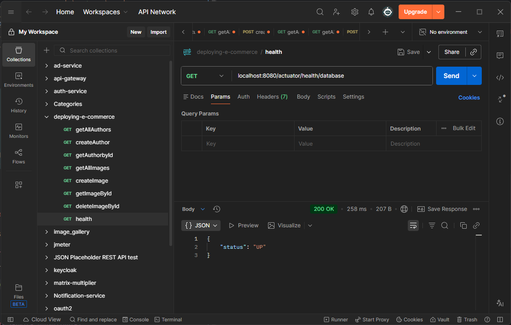
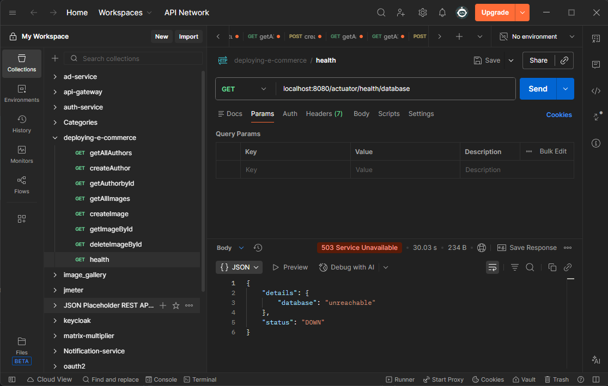
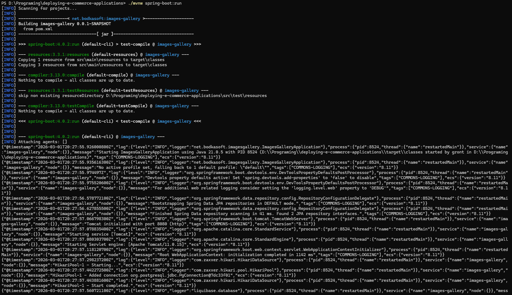
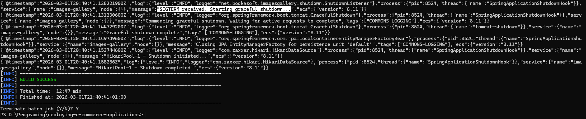

# Лабораторна робота №0: Підготовка застосунку — Readiness & Standardization

This microservice is designed for managing an image gallery.

---

## Configuration (Environment Variables)

To run the application correctly (database connection and server settings), the following environment variables must be set:

| Variable | Description               | Example Value |
| :--- |:--------------------------|:--------------|
| `DB_NAME` | Database name             | `postgres`    |
| `DB_USER` | Database username         | `user`        |
| `DB_PASSWORD` | Database password         | `123`         |
| `DB_PORT` | Port the database runs on | `5454`        |
| `DB_HOST` | Database host             | `localhost`   |

## Start

```bash
# Package application
mvn clean package

# Start tests
mvn test

# Start application (requires PostgreSQL)
java -jar target/images-gallery-0.0.1-SNAPSHOT.jar
```

---

## Health Check Confirmation

The application uses **Spring Boot Actuator** to monitor the service status and database connectivity.

### Database Connected (200 OK)
When PostgreSQL is running normally, the `/actuator/health/database` endpoint returns an `UP` status.

**Command:** `curl -i localhost:8080/actuator/health/database`



### Database Stopped (503 Service Unavailable)
If the database connection is lost (DB stopped manually), Actuator changes the status to `DOWN`.

**Command:** `curl -i localhost:8080/actuator/health/database`



---

## JSON Log Examples

The application is configured to output logs in JSON format for integration with log aggregation systems (ELK/Loki). 

Example log structure during initialization:



---

## Graceful Shutdown Confirmation

The application implements graceful shutdown. Upon receiving a SIGTERM signal.



---

## Tests

Tests result:


